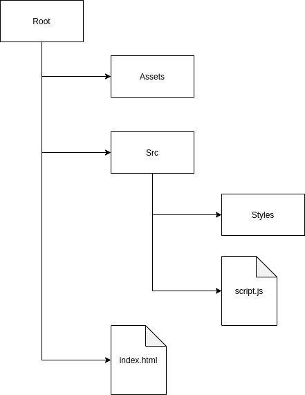
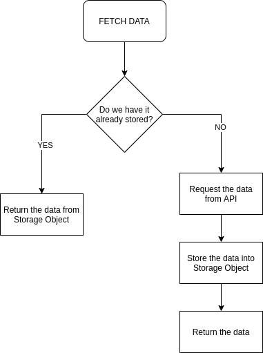

# RICK & MORTY WIKI

In this project I have developed a web page that makes requests to the API of rick and morty to extract data about the series in a dynamic way.

Next we will see the structure of the project and how we make such requests to the API.

## PROJECT STRUCTURE

I have structured the project so that the styles/scripts are separated from the files as images or fonts.

All css files necessary for the main style of the page are stored in the styles folder.

The script.js file contains all the logic of the web page. All calls to the rick and morty API are made there and we'll talk about that in a moment.

Also, in the assets folder I have downloaded the original source of the series to make the page as familiar as possible.



## RICK & MORTY API

In the [documentation of the API](https://rickandmortyapi.com/) is everything you need to learn how to navigate through it.
The API is mainly based on the principles of HATEOAS and pagination.

After making the first call to the main API EndPoint, we make a request to the chapters EndPoint.
The API returns the first page (max 20 chapters) and the EndPoint of the next page so we can continue making more calls.

```javascript
// https://rickandmortyapi.com/api/episode?page=1
{
    "info": {
        "count": 41,
        "pages": 3,
        "next": "https://rickandmortyapi.com/api/episode?page=2",
        "prev": null
    },
    "results": [...]
}
```

The results array contains the data of all the chapters on the first page which contain the data about the characters of each one so that we can continue browsing the API.

In the same way, each character returns the EndPoint of its location and each location contains a list of EndPoints of the resident characters of that location.

### Episode

```javascript
//https://rickandmortyapi.com/api/episode/21
 {
    "id": 21,
    "name": "The Wedding Squanchers",
    "air_date": "October 4, 2015",
    "episode": "S02E10",
    "characters": [
        "https://rickandmortyapi.com/api/character/1",
        ...
    ],
    "url": "https://rickandmortyapi.com/api/episode/21",
    "created": "2017-11-10T12:56:35.875Z"
}
```

### Character

```javascript
//https://rickandmortyapi.com/api/character/8
{
    "id": 8,
    "name": "Adjudicator Rick",
    ...
    },
    "location": {
        "name": "Citadel of Ricks",
        "url": "https://rickandmortyapi.com/api/location/3"
    },
    "image": "https://rickandmortyapi.com/api/character/avatar/8.jpeg",
    "episode": [
        "https://rickandmortyapi.com/api/episode/28"
    ],
    ...
}
```

### Location

```javascript
//https://rickandmortyapi.com/api/location/3
{
    "id": 3,
    "name": "Citadel of Ricks",
    "type": "Space station",
    "dimension": "unknown",
    "residents": [
        "https://rickandmortyapi.com/api/character/8",
        ...
    ],
    "url": "https://rickandmortyapi.com/api/location/3",
    "created": "2017-11-10T13:08:13.191Z"
}
```

In this case, I store in an object all the data I obtain with each request (episodes, characters, etc.).

In this way, if in the future we make another request for a piece of data, we first check if we already have it and if not, make the call.
This allows our page to load faster the data we have already called.

## FETCH Process Diagram


